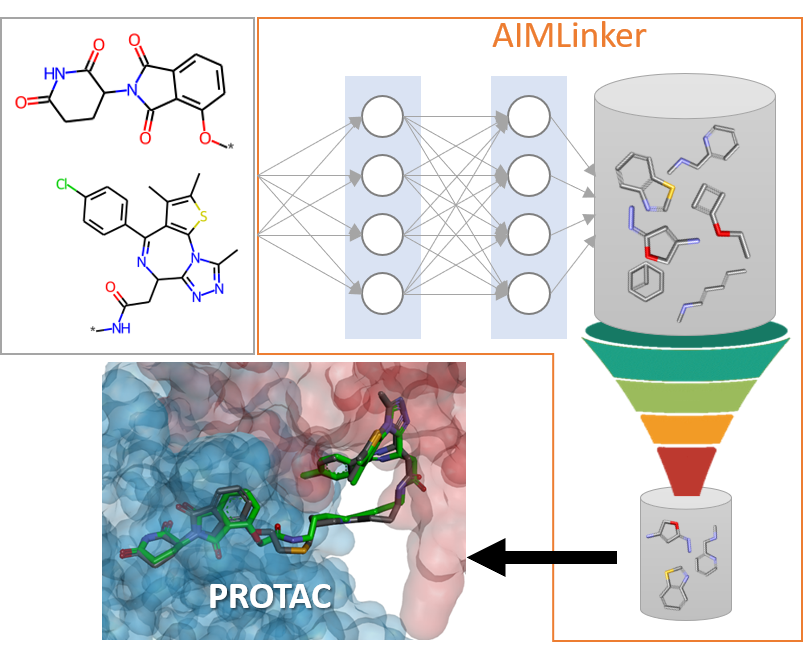

# Fragment Linker Prediction Using Deep Encoder-Decoder Network for PROTAC Drug Design

This repository contains parts of our disclosed data. 

## Data Preprocess
We take "dBET6 fragments.mol" for testing.

## Postprocess
Code in "postprocess.py" reveals some functions we designed to filtering ourputs generated from deep encoder-decoder network.

## Docking Validation

## License

## Contact Us

Please contact Chu-Chung Lin [clin@anhornmed.com](mailto:clin@anhornmed.com).