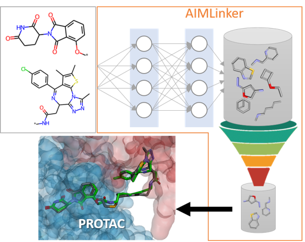

# Fragment Linker Prediction Using Deep Encoder-Decoder Network for PROTAC Drug Design

This repository contains parts of our disclosed data. 

## Data Preprocess
We take "dBET6 fragments.mol" for testing.

## Model
The training set "dataset.smi" is constructed from PROTAC-DB and ZINC.

## Postprocess
Code in "postprocess.py" reveals some functions we designed to filtering ourputs generated from deep encoder-decoder network.

## Docking Validation
The files "docking protein.pdb" and "docking ligands.smi", including predicted molecules passing the postprocess step, are input for docking validation. Top 10 best RMSD outputs are listed in "top 10 docking compounds.sdf".

## Contact Us
Please contact Chu-Chung Lin [cclin@anhornmed.com](mailto:cclin@anhornmed.com).
